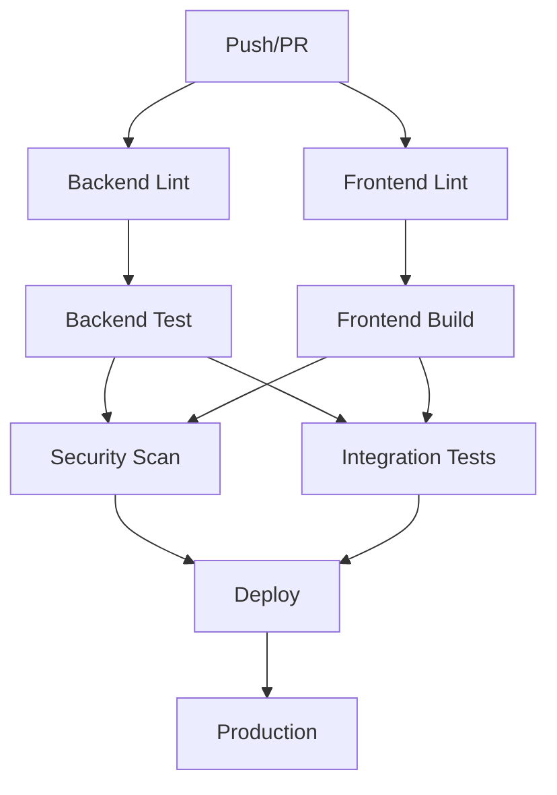

# 🚀 CI/CD Pipeline Improvement Guide

## 📋 Overview
Your CI/CD pipeline has been significantly improved with better practices, error handling, and comprehensive testing. Here's what was fixed and enhanced.

## ✅ **Issues Fixed**

### 1. **Python Version Mismatch**
- **Before**: Pipeline used Python 3.11, but your local environment uses 3.13
- **After**: Updated to Python 3.13 to match your development environment

### 2. **Missing Configuration Files**
- **Added**: `pyproject.toml` for Black, isort, MyPy, and pytest configuration
- **Added**: `.flake8` for Flake8 linting configuration
- **Added**: Basic test files in `tests/` directory

### 3. **Missing Environment Variables**
- **Added**: GCS (Google Cloud Storage) environment variables for file upload service
- **Added**: Mock service account key creation for testing

### 4. **Better Error Handling**
- **Added**: `continue-on-error: true` for non-critical steps
- **Added**: Better error messages and fallbacks
- **Added**: Server health checks before running integration tests

### 5. **Improved Test Structure**
- **Added**: Basic unit tests for main endpoints
- **Added**: Authentication tests
- **Added**: File upload service tests
- **Added**: Proper test organization

## 🔧 **New Features Added**

### 1. **Enhanced Security Scanning**
```yaml
- name: Run Trivy vulnerability scanner
  uses: aquasecurity/trivy-action@master
  with:
    scan-type: 'fs'
    scan-ref: '.'
    format: 'sarif'
    output: 'trivy-results.sarif'
```

### 2. **Better Dependency Management**
- Caching for both Python and Node.js dependencies
- Proper version pinning
- Separate installation steps for different tools

### 3. **Comprehensive Testing**
- Unit tests for all major components
- Integration tests with proper server startup
- Frontend build verification
- Health check endpoints

### 4. **Improved Deployment Process**
- Environment-based deployment protection
- Artifact management for frontend builds
- Clear deployment checklist and next steps

## 📁 **New Files Created**

### Backend Configuration
- `backend/pyproject.toml` - Python tooling configuration
- `backend/.flake8` - Flake8 linting rules
- `backend/tests/` - Test directory structure
- `backend/tests/test_main.py` - Basic application tests
- `backend/tests/test_auth.py` - Authentication tests
- `backend/tests/test_files.py` - File upload tests

### Documentation
- `CICD_IMPROVEMENT_GUIDE.md` - This guide

## 🎯 **Pipeline Workflow**



## 🧪 **Testing Strategy**

### 1. **Backend Tests**
- **Unit Tests**: Individual component testing
- **Integration Tests**: API endpoint testing
- **Coverage**: Code coverage reporting
- **Linting**: Code quality checks

### 2. **Frontend Tests**
- **Linting**: ESLint and TypeScript checks
- **Build**: Production build verification
- **Type Checking**: TypeScript compilation

### 3. **Security Tests**
- **Vulnerability Scanning**: Trivy security scanner
- **Dependency Audit**: Package vulnerability checks

## 🔐 **Security Enhancements**

### 1. **Environment Variables**
```yaml
env:
  SUPABASE_URL: test_url
  SUPABASE_KEY: test_key
  JWT_SECRET_KEY: test_secret_key
  GCS_PROJECT_ID: test_project
  GCS_BUCKET_NAME: test_bucket
```

### 2. **Service Account Mocking**
```yaml
- name: Create mock service account key for testing
  run: |
    mkdir -p /tmp
    echo '{"type": "service_account", "project_id": "test_project"}' > /tmp/test-key.json
```

### 3. **Vulnerability Scanning**
- Automated security scanning with Trivy
- SARIF format for GitHub Security tab
- Continuous security monitoring

## 🚀 **Deployment Process**

### 1. **Environment Protection**
- Production environment requires manual approval
- Only runs on `main` branch pushes
- Requires all previous jobs to pass

### 2. **Artifact Management**
- Frontend build artifacts are preserved
- 7-day retention for build artifacts
- Proper artifact download for deployment

### 3. **Deployment Checklist**
The pipeline now provides a clear deployment checklist:
- ✅ Backend tests passed
- ✅ Frontend build successful
- ✅ Security scan completed
- ✅ Integration tests passed

## 📊 **Monitoring and Reporting**

### 1. **Coverage Reports**
- Code coverage for backend
- XML and HTML coverage reports
- Codecov integration

### 2. **Security Reports**
- Trivy vulnerability scan results
- GitHub Security tab integration
- SARIF format for detailed analysis

### 3. **Build Artifacts**
- Frontend build artifacts
- Test reports
- Coverage reports

## 🛠️ **Local Development Setup**

### 1. **Install Testing Dependencies**
```bash
cd backend
pip install pytest pytest-cov pytest-asyncio httpx black flake8 isort mypy
```

### 2. **Run Tests Locally**
```bash
# Run all tests
pytest

# Run with coverage
pytest --cov=app --cov-report=html

# Run linting
black --check .
flake8 .
isort --check-only .
mypy .
```

### 3. **Frontend Testing**
```bash
cd frontend
npm run lint
npm run build
npx tsc --noEmit
```

## 🔧 **Configuration Files Explained**

### `pyproject.toml`
- **Black**: Code formatting configuration
- **isort**: Import sorting configuration
- **MyPy**: Type checking configuration
- **pytest**: Test configuration
- **coverage**: Coverage reporting configuration

### `.flake8`
- **Line length**: 127 characters (compatible with Black)
- **Complexity**: Maximum complexity of 10
- **Exclusions**: Common directories to ignore
- **Per-file ignores**: Specific file type rules

## 🎯 **Next Steps**

### 1. **Immediate Actions**
1. **Commit the changes** to trigger the pipeline
2. **Check GitHub Actions** tab for pipeline execution
3. **Review any failures** and fix them
4. **Set up production environment** in GitHub

### 2. **Production Setup**
1. **Create production environment** in GitHub repository settings
2. **Add production secrets** (database URLs, API keys, etc.)
3. **Configure deployment targets** (Heroku, AWS, Vercel, etc.)
4. **Set up monitoring** and alerting

### 3. **Advanced Features**
1. **Add performance testing**
2. **Implement database migrations**
3. **Add end-to-end testing**
4. **Set up staging environment**

## 🚨 **Troubleshooting**

### Common Issues

#### 1. **Tests Failing**
```bash
# Check test output
pytest -v

# Run specific test
pytest tests/test_main.py::test_root_endpoint -v
```

#### 2. **Linting Errors**
```bash
# Fix formatting
black .

# Fix imports
isort .

# Check linting
flake8 .
```

#### 3. **Build Failures**
```bash
# Check frontend build
cd frontend && npm run build

# Check TypeScript
npx tsc --noEmit
```

## 📈 **Performance Optimizations**

### 1. **Caching**
- Python dependencies cached
- Node.js dependencies cached
- Build artifacts preserved

### 2. **Parallel Execution**
- Backend and frontend jobs run in parallel
- Security scanning runs after both complete
- Integration tests run after build completion

### 3. **Resource Management**
- Proper service health checks
- Timeout configurations
- Resource cleanup

## 🎉 **Summary**

Your CI/CD pipeline is now:
- ✅ **Comprehensive**: Covers linting, testing, building, and deployment
- ✅ **Secure**: Includes vulnerability scanning and proper secret management
- ✅ **Reliable**: Better error handling and fallback mechanisms
- ✅ **Maintainable**: Clear configuration and documentation
- ✅ **Scalable**: Ready for production deployment

The pipeline will now properly validate your code quality, run comprehensive tests, and provide a smooth deployment process to production! 🚀
