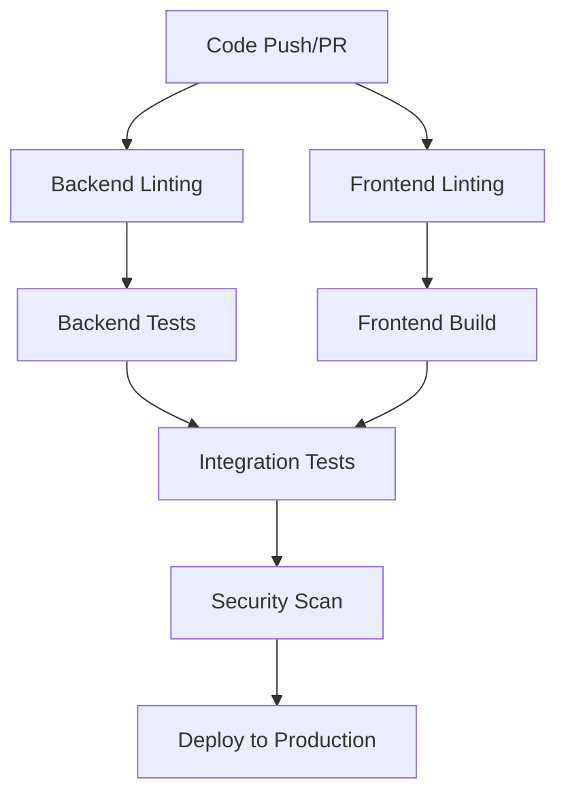

# 🚀 CI/CD Pipeline Guide

## Overview
This guide explains the comprehensive CI/CD pipeline implemented for your full-stack application. The pipeline ensures code quality, security, and reliable deployments.

## 🔄 Pipeline Workflow

### Trigger Events
- **Push to `main` or `develop` branches**
- **Pull requests to `main` or `develop` branches**

### Pipeline Stages



## 📋 Pipeline Jobs

### 1. Backend Linting (`backend-lint`)
**Purpose**: Code quality and style checks for Python backend

**Tools Used**:
- **Black**: Code formatting
- **isort**: Import sorting
- **Flake8**: Linting and style checking
- **MyPy**: Type checking

**Configuration**:
```yaml
- Black: 88 character line length
- isort: Compatible with Black
- Flake8: Max complexity 10, line length 127
- MyPy: Strict type checking with ignored missing imports
```

### 2. Backend Tests (`backend-test`)
**Purpose**: Unit and integration tests for backend

**Features**:
- **PostgreSQL Service**: Test database
- **Coverage Reporting**: Code coverage metrics
- **Environment Variables**: Test configuration
- **Parallel Execution**: Fast test runs

**Test Structure**:
```
backend/tests/
├── __init__.py
├── test_auth.py          # Authentication tests
├── test_file_upload.py   # File upload tests
└── test_user_service.py  # User service tests
```

### 3. Frontend Linting (`frontend-lint`)
**Purpose**: Code quality checks for Next.js frontend

**Tools Used**:
- **ESLint**: JavaScript/TypeScript linting
- **TypeScript Compiler**: Type checking

**Configuration**:
- ESLint with Next.js configuration
- TypeScript strict mode
- No emit for type checking only

### 4. Frontend Build (`frontend-build`)
**Purpose**: Build and validate frontend application

**Features**:
- **Turbopack**: Fast builds
- **Artifact Upload**: Build artifacts for deployment
- **Environment Variables**: Build-time configuration

### 5. Security Scan (`security-scan`)
**Purpose**: Security vulnerability scanning

**Tools Used**:
- **Trivy**: Container and filesystem scanning
- **SARIF**: Security results format
- **GitHub Security Tab**: Integration with GitHub security features

### 6. Integration Tests (`integration-tests`)
**Purpose**: End-to-end testing of the full application

**Features**:
- **Backend Server**: Starts FastAPI server
- **API Testing**: HTTP requests to all endpoints
- **Log Analysis**: Server logs on failure

### 7. Deployment (`deploy`)
**Purpose**: Production deployment

**Features**:
- **Environment Protection**: Production environment
- **Artifact Download**: Frontend build artifacts
- **Manual Trigger**: Only on main branch pushes
- **Deployment Commands**: Configurable deployment steps

## 🛠️ Configuration Files

### Backend Configuration

#### `pytest.ini`
```ini
[tool:pytest]
testpaths = tests
python_files = test_*.py
python_classes = Test*
python_functions = test_*
addopts = 
    -v
    --tb=short
    --strict-markers
    --disable-warnings
    --cov=app
    --cov-report=term-missing
    --cov-report=html
    --cov-report=xml
```

#### `pyproject.toml`
```toml
[tool.black]
line-length = 88
target-version = ['py311']

[tool.isort]
profile = "black"
multi_line_output = 3
line_length = 88

[tool.mypy]
python_version = "3.11"
warn_return_any = true
disallow_untyped_defs = true
```

### Frontend Configuration

#### `package.json` Scripts
```json
{
  "scripts": {
    "dev": "next dev --turbopack",
    "build": "next build --turbopack",
    "start": "next start",
    "lint": "eslint"
  }
}
```

## 🔧 Local Development Setup

### Backend Setup
```bash
# Install dependencies
cd backend
pip install -r requirements.txt

# Run linting
black --check .
isort --check-only .
flake8 .
mypy .

# Run tests
pytest --cov=app -v

# Format code
black .
isort .
```

### Frontend Setup
```bash
# Install dependencies
cd frontend
npm install

# Run linting
npm run lint

# Check types
npx tsc --noEmit

# Build application
npm run build
```

## 🚀 Deployment Configuration

### Environment Variables
Set these in your deployment platform:

#### Backend Environment Variables
```env
# Database
SUPABASE_URL=your_supabase_url
SUPABASE_KEY=your_supabase_key

# Authentication
JWT_SECRET_KEY=your_jwt_secret
ACCESS_TOKEN_EXPIRE_MINUTES=2880

# Google Cloud Storage
GCS_PROJECT_ID=your_project_id
GCS_BUCKET_NAME=your_bucket_name
GOOGLE_APPLICATION_CREDENTIALS=/path/to/service-account.json

# Email Service
SMTP_SERVER=smtp.gmail.com
SMTP_PORT=587
SMTP_USERNAME=your_email
SMTP_PASSWORD=your_app_password
SENDER_EMAIL=your_email
```

#### Frontend Environment Variables
```env
NEXT_PUBLIC_API_URL=https://your-api-domain.com
```

### Deployment Platforms

#### Option 1: Heroku
```yaml
# Add to CI/CD pipeline
- name: Deploy to Heroku
  uses: akhileshns/heroku-deploy@v3.12.14
  with:
    heroku_api_key: ${{secrets.HEROKU_API_KEY}}
    heroku_app_name: "your-app-name"
    heroku_email: "your-email@example.com"
```

#### Option 2: AWS
```yaml
# Add to CI/CD pipeline
- name: Deploy to AWS
  uses: aws-actions/configure-aws-credentials@v4
  with:
    aws-access-key-id: ${{ secrets.AWS_ACCESS_KEY_ID }}
    aws-secret-access-key: ${{ secrets.AWS_SECRET_ACCESS_KEY }}
    aws-region: us-east-1
```

#### Option 3: Vercel (Frontend)
```yaml
# Add to CI/CD pipeline
- name: Deploy to Vercel
  uses: amondnet/vercel-action@v25
  with:
    vercel-token: ${{ secrets.VERCEL_TOKEN }}
    vercel-org-id: ${{ secrets.ORG_ID }}
    vercel-project-id: ${{ secrets.PROJECT_ID }}
    working-directory: ./frontend
```

## 📊 Monitoring and Notifications

### GitHub Actions Features
- **Status Checks**: Required for merging PRs
- **Artifact Storage**: Build artifacts for 7 days
- **Security Scanning**: Integrated with GitHub Security tab
- **Coverage Reports**: Code coverage metrics

### Notification Options
```yaml
# Add to workflow
- name: Notify on Success
  if: success()
  run: |
    echo "✅ Deployment successful!"
    # Add Slack/Discord/Email notifications

- name: Notify on Failure
  if: failure()
  run: |
    echo "❌ Deployment failed!"
    # Add failure notifications
```

## 🔍 Troubleshooting

### Common Issues

#### 1. Tests Failing
```bash
# Check test logs
pytest -v --tb=long

# Run specific test
pytest tests/test_auth.py::TestAuthentication::test_user_registration_success -v
```

#### 2. Linting Errors
```bash
# Fix Black formatting
black .

# Fix import sorting
isort .

# Check Flake8 issues
flake8 . --count --select=E9,F63,F7,F82 --show-source --statistics
```

#### 3. Build Failures
```bash
# Check frontend build
cd frontend
npm run build

# Check TypeScript errors
npx tsc --noEmit
```

#### 4. Security Scan Issues
- Review Trivy scan results in GitHub Security tab
- Update dependencies with known vulnerabilities
- Review code for security best practices

### Debug Commands
```bash
# Run pipeline locally
act -j backend-lint
act -j frontend-lint
act -j backend-test

# Check GitHub Actions logs
gh run list
gh run view <run-id>
```

## 📈 Best Practices

### Code Quality
1. **Write Tests**: Aim for >80% code coverage
2. **Follow Style Guides**: Use Black, isort, ESLint
3. **Type Hints**: Use MyPy for Python type checking
4. **Documentation**: Add docstrings and comments

### Security
1. **Dependency Updates**: Keep dependencies updated
2. **Secret Management**: Use GitHub Secrets
3. **Environment Variables**: Never commit secrets
4. **Security Scanning**: Regular vulnerability scans

### Performance
1. **Caching**: Use GitHub Actions cache
2. **Parallel Jobs**: Run independent jobs in parallel
3. **Artifact Management**: Store and reuse build artifacts
4. **Resource Optimization**: Use appropriate runner sizes

## 🎯 Next Steps

1. **Set up GitHub Secrets** for deployment
2. **Configure deployment platform** (Heroku, AWS, Vercel)
3. **Add monitoring** (Sentry, DataDog, etc.)
4. **Set up notifications** (Slack, Discord, Email)
5. **Configure branch protection** rules
6. **Add performance testing** to pipeline

## 📚 Resources

- [GitHub Actions Documentation](https://docs.github.com/en/actions)
- [FastAPI Testing](https://fastapi.tiangolo.com/tutorial/testing/)
- [Next.js Deployment](https://nextjs.org/docs/deployment)
- [Pytest Documentation](https://docs.pytest.org/)
- [ESLint Configuration](https://eslint.org/docs/user-guide/configuring/)

Your CI/CD pipeline is now production-ready! 🚀

